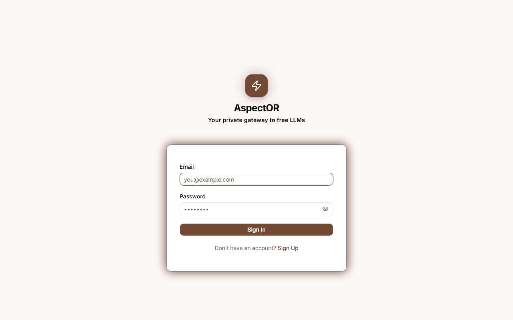
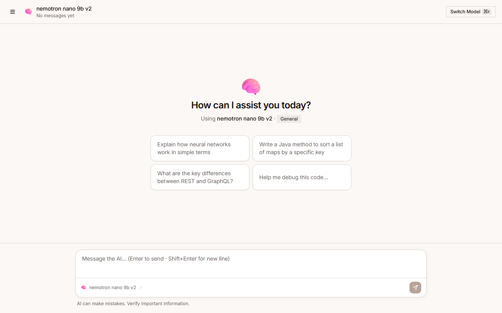
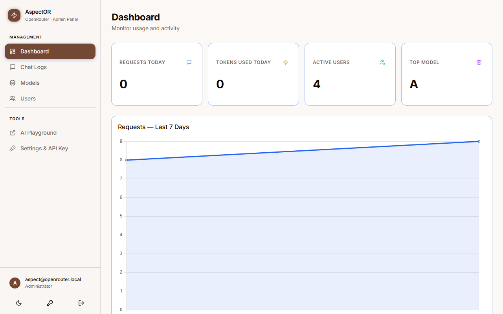
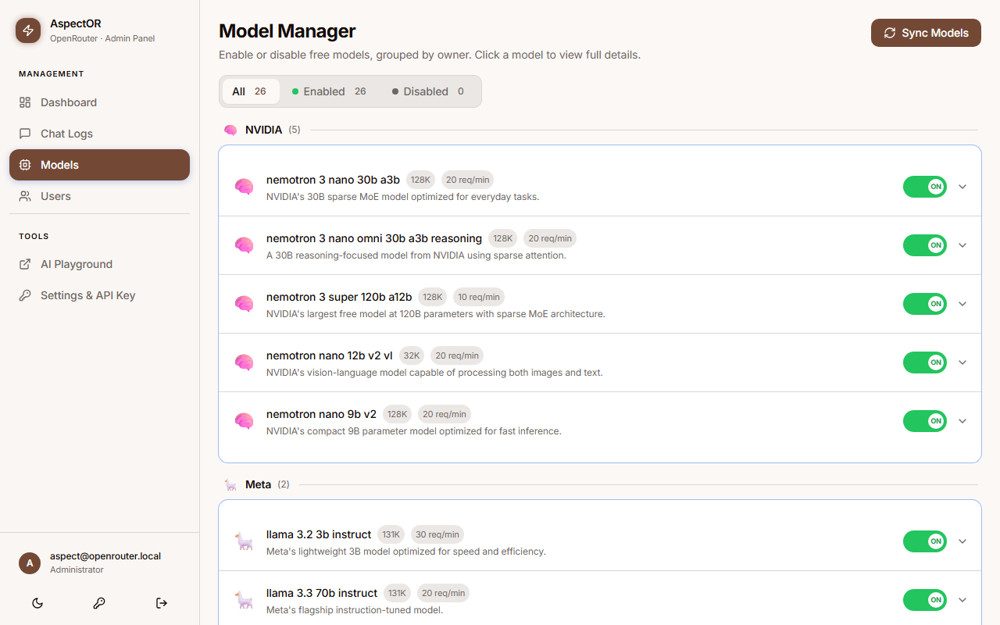
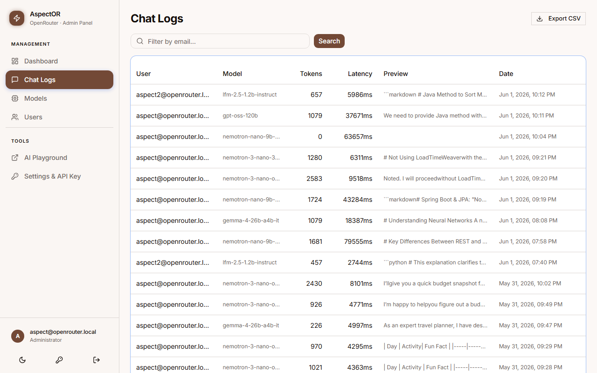
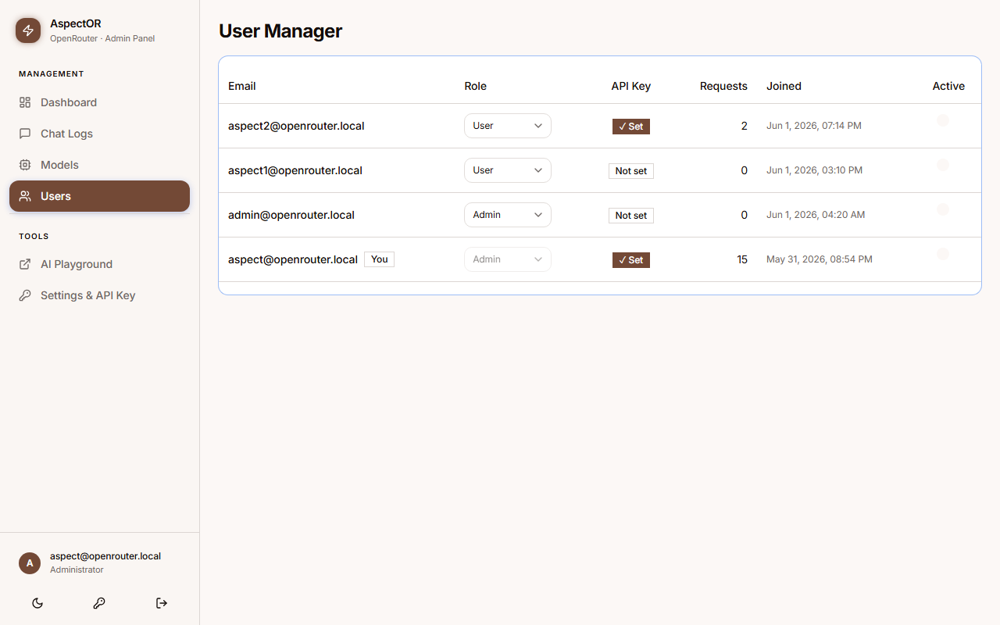
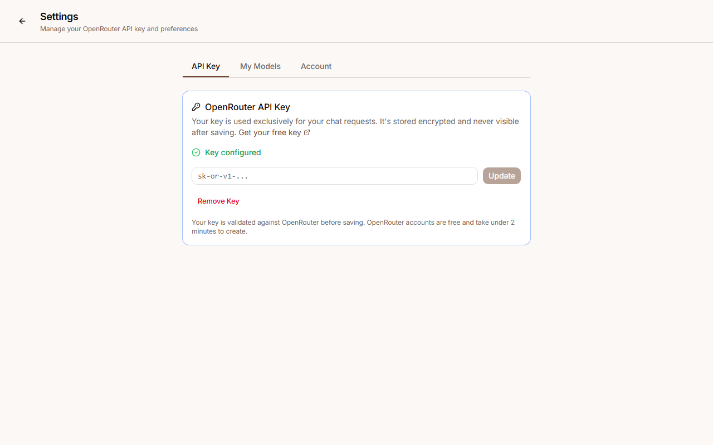
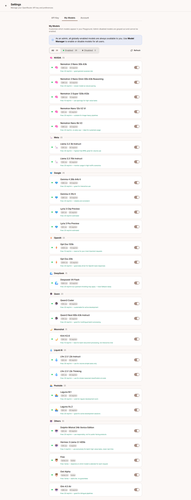

# AspectOR — Secure OpenRouter Gateway

A self-hosted, secure API gateway for [OpenRouter](https://openrouter.ai) free-tier LLMs.
JWT-authenticated, rate-limited, fully logged, with per-user BYOK keys, usage limits,
model preferences, auto-sync of free models, an admin dashboard, an AI Playground with
SSE streaming, a Gateway Intelligence Agent (ReAct loop, two tools, live retry status),
and an Orchestrator Hub (parallel LLM fan-out with live SSE streaming + AI synthesis).

> **Stack:** Docker · nginx · Spring Boot 3.5 (Java 25) · MySQL 8 · React + Vite + shadcn/ui  
> **Tested on:** Windows 11 (Docker Desktop + PowerShell)

**New here?** Follow **[GETTING_STARTED.md](GETTING_STARTED.md)** for a full step-by-step
walkthrough (env setup, secret generation, troubleshooting). The sections below are a
reference once you're up and running.

---

## Screenshots

| Login | AI Playground |
|---|---|
|  |  |

| Admin Dashboard | Model Manager |
|---|---|
|  |  |

| Chat Logs | User Manager |
|---|---|
|  |  |

| Settings — API Key | Settings — My Models |
|---|---|
|  |  |

| Gateway Agent | Orchestrator Hub |
|---|---|
|  | *(screenshot pending)* |

---

## Architecture

```
Browser (localhost:3000)
  │
  ▼ HTTP :8080
Spring Boot — JWT auth, rate limiting (Bucket4j), chat logging,
              conversations, BYOK key management, usage tracking,
              user model preferences, free model auto-sync,
              Gateway Intelligence Agent (ReAct, SSE, model retry),
              Orchestrator Hub (parallel fan-out, SSE, AI synthesis)
  │
  ▼ HTTP :8081 (localhost only)
nginx reverse proxy — Authorization pass-through, TLS to OpenRouter
  │
  ▼ HTTPS
openrouter.ai (free models only)
  │
  ▼
MySQL :3309 — users, chat_logs, conversations, conversation_messages,
              model_config, model_usage_limits, user_model_usage,
              user_model_preferences
```

---

## Prerequisites

| Tool | Version | Notes |
|---|---|---|
| Docker Desktop | 4.x+ | Includes Compose v2 |
| Java | 21 (Gradle runtime) + 25 (app toolchain) | See ADR-004 |
| Node | 22 + npm 10 | Admin UI local dev only |

---

## Quick Start

```cmd
cp .env.example .env        :: fill in all required secrets (see below)

docker compose up -d        :: starts all 4 services
docker compose ps           :: wait for all (healthy)
```

Open **http://localhost:3000** — log in with `admin@openrouter.local` / `Admin@2026!`.  
**Change the admin password immediately after first login.**

On first startup, Spring Boot automatically syncs free models from OpenRouter and adds
any new ones to the database as disabled. Review them in **Model Manager** before enabling.

---

## Environment Variables

All secrets live in `.env` — never committed. Copy from `.env.example`.

| Variable | Used by | Notes |
|---|---|---|
| `OPENROUTER_API_KEY` | nginx + Spring Boot | nginx: Authorization pass-through for chat. Spring Boot: optional, used by `FreeModelSyncService` to fetch the models list |
| `DEFAULT_MODEL` | test scripts | Default free model for smoke tests |
| `MYSQL_ROOT_PASSWORD` | MySQL | |
| `MYSQL_DATABASE` | MySQL + Spring Boot | `openrouter_gateway` |
| `MYSQL_USER` | MySQL + Spring Boot | |
| `MYSQL_PASSWORD` | MySQL + Spring Boot | |
| `JWT_SECRET` | Spring Boot | Base64-encoded, minimum 256 bits (32 bytes) |
| `JWT_EXPIRATION_MS` | Spring Boot | Default: `86400000` (24h) |
| `OPENROUTER_PROXY_URL` | Spring Boot | `http://localhost:8081` local · `http://openrouter-proxy:8080` Docker |
| `ENCRYPTION_MASTER_KEY` | Spring Boot | 64-char hex (32 bytes) for AES-GCM encryption of stored user API keys |

Generate a JWT secret:
```powershell
powershell -command "[Convert]::ToBase64String((1..32 | ForEach-Object { [byte](Get-Random -Max 256) }))"
```

Generate an encryption master key:
```powershell
openssl rand -hex 32
```

---

## Schema Management

Schema is owned by **Flyway** (`ddl-auto=validate`). Migrations live in
`app/src/main/resources/db/migration/`:

| Migration | Content |
|---|---|
| `V1__initial_schema.sql` | Core tables: users, chat_logs, conversations, conversation_messages, model_config |
| `V2__seed_model_config.sql` | Initial free model rows (enabled=true) |
| `V3__seed_admin_user.sql` | Default admin user |
| `V4__byok_usage_tracking.sql` | model_usage_limits, user_model_usage — BYOK + daily usage tracking |
| `V5__user_model_preferences.sql` | user_model_preferences — per-user model toggle state (sparse) |
| `V6__disable_removed_free_models.sql` | Disables models removed from OpenRouter's free tier |
| `V7__cleanup_free_model_duplicates.sql` | Removes base model IDs that have a `:free` counterpart (PRD-004 dedup) |

**Never edit V1–V7 after they have been applied.** Add `V8+` for any schema change.

New free models discovered after initial seed are inserted at runtime by `FreeModelSyncService`
(not Flyway) with `enabled=false`.

Flyway runs automatically on startup. To reset (development only):
```sql
DROP DATABASE openrouter_gateway;
CREATE DATABASE openrouter_gateway CHARACTER SET utf8mb4 COLLATE utf8mb4_unicode_ci;
```
Then restart — Flyway re-applies all migrations from scratch.

---

## Running Locally (Development)

```cmd
:: Start infrastructure
docker compose up -d openrouter-proxy openrouter-mysql
docker compose ps           :: wait for both (healthy)

:: Spring Boot (loads .env, switches to Java 21, runs gradlew bootRun)
run-app.bat

:: Admin UI (Vite dev server — proxies /api → :8080)
cd admin-ui && npm run dev
```

Build Spring Boot without tests:
```cmd
cd app && gradlew.bat build -x test
```

---

## API Endpoints

### Auth (public)
```
POST /api/auth/register
POST /api/auth/login
POST /api/auth/change-password          (JWT required)
```

### Chat (JWT — ROLE_USER or ROLE_ADMIN)
```
POST /api/chat/completions
GET  /api/chat/models
```

### Conversations (JWT — ROLE_USER or ROLE_ADMIN)
```
GET    /api/conversations
POST   /api/conversations
GET    /api/conversations/{id}
POST   /api/conversations/{id}/messages         blocking
POST   /api/conversations/{id}/messages/stream  SSE streaming
DELETE /api/conversations/{id}
```

SSE stream events: `token` (delta string, JSON-encoded) · `done` (messageId, title, usage) · `error`

### BYOK API Key (JWT)
```
PUT    /api/user/api-key        {"apiKey": "sk-or-v1-..."}
DELETE /api/user/api-key
GET    /api/user/api-key/status
```

### User Model Preferences (JWT — ROLE_USER or ROLE_ADMIN)
```
GET /api/user/models
PUT /api/user/models/{id}/toggle    {id} = model_config integer PK (not string modelId)
GET /api/user/models/{id}/status
```

### Admin (JWT — ROLE_ADMIN)
```
GET  /api/admin/stats
GET  /api/admin/chat-logs               ?page=0&size=20&user=&model=&from=&to=
GET  /api/admin/chat-logs/export        CSV
GET  /api/admin/models
PUT  /api/admin/models/toggle           body: {modelId}
POST /api/admin/sync-models             Fetch OpenRouter free models list, insert new ones as disabled
GET  /api/admin/users
PUT  /api/admin/users/{id}/role
PUT  /api/admin/users/{id}/status
GET  /api/admin/usage-limits
PUT  /api/admin/usage-limits            body: {modelId, maxRequestsPerDay, maxTokensPerDay}
```

### Agent (JWT — ROLE_ADMIN)
```
POST /api/agent/chat    SSE stream — ReAct agent loop with model auto-retry
```

Request body: `{"question":"...","model":"optional","history":[{"role":"user","content":"..."}]}`

SSE event protocol:
```
event: status   data: {"type":"trying","model":"...","attempt":1,"total":12}
event: status   data: {"type":"skipped","model":"...","reason":"rate_limited"|"tool_unsupported"}
event: done     data: {"reply":"...","toolSteps":[...],"modelUsed":"..."}
event: error    data: {"error":"...","status":409|400|503|500}
```

Default model: `meta-llama/llama-3.3-70b-instruct:free`.  
Requires BYOK API key configured in Settings (409 if missing).  
Consumer must use `fetch` + `ReadableStream` — `EventSource` does not support POST.

### Orchestrator Hub (JWT — ROLE_USER or ROLE_ADMIN)
```
POST /api/orchestrate/stream      SSE stream — fan-out prompt to all enabled models in parallel
POST /api/orchestrate/synthesize  Blocking — synthesize collected responses into one answer
```

`/stream` request body: `{"prompt":"..."}`

SSE event protocol:
```
event: model_response   data: {"modelId":"...","name":"...","content":"...","latencyMs":1234,"status":"SUCCESS"}
event: all_done         data: {"successCount":3,"totalModels":5,"totalMs":4567}
event: error            data: {"error":"..."}
```

`/synthesize` request body: `{"prompt":"...","responses":[{"modelId":"...","name":"...","content":"...","latencyMs":0,"status":"SUCCESS"}]}`

`/synthesize` response: `{"content":"...","modelId":"...","modelName":"..."}`

Fan-out uses all models the user has enabled (My Models). Requires BYOK API key (409 if missing).  
Consumer must use `fetch` + `ReadableStream` for `/stream` — `EventSource` does not support POST.

### System
```
GET /actuator/health
GET http://localhost:8081/health        nginx proxy health
```

---

## Free Models

New free models are **discovered automatically** on every startup via `FreeModelSyncService`,
which calls `https://openrouter.ai/api/v1/models` and inserts any new free models as disabled.
Admins review and enable them in **Model Manager**.

Models removed from OpenRouter's free tier are auto-disabled the first time a user attempts
to stream a response — a 404 from upstream triggers `autoDisableRemovedModel()`.

To manually trigger a sync: **Model Manager → Sync Models button** (`POST /api/admin/sync-models`).

Check current OpenRouter free models: https://openrouter.ai/models?max_price=0

---

## Security

- API key injected at runtime via `envsubst` — never baked into image layers
- User OpenRouter keys encrypted at rest with AES-GCM (`ENCRYPTION_MASTER_KEY`)
- All ports bound to `127.0.0.1` only
- Container runs as non-root (`nginx` user, uid 101)
- Root filesystem is read-only (`read_only: true`)
- All Linux capabilities dropped (`cap_drop: ALL`)
- JWT secret enforced minimum 256 bits at startup (JJWT)
- BCrypt strength 12

---

## Troubleshooting

| Symptom | Cause | Fix |
|---|---|---|
| `WeakKeyException` on startup | JWT_SECRET too short | Regenerate — min 32 bytes Base64 |
| nginx restarting | `OPENROUTER_API_KEY` missing | Add key to `.env` |
| `SchemaManagementException: wrong column type [enabled]` | Boolean column created as TINYINT instead of BIT(1) | Hibernate 6 maps Java `boolean` → `BIT`; use `BIT(1)` in all Flyway migrations |
| Flyway checksum mismatch | Applied migration edited after apply | Never edit V1–V7; add V8+ instead; drop DB for dev reset |
| `IllegalArgumentException: ENCRYPTION_MASTER_KEY must be 64 hex chars` | Key missing or wrong format | Generate: `openssl rand -hex 32`, set in `.env` |
| Admin login fails | User not seeded | Flyway V3 seeds admin on fresh DB; check `users` table |
| Chat returns 409 | User has no API key configured | Go to Settings → add OpenRouter API key |
| Duplicate models in My Models / Model Manager | Startup sync inserted both `X` (pricing=0) and `X:free` | V7 migration cleans up on next restart; dedup logic prevents recurrence |
| `POST /api/admin/sync-models` returns 500 | OpenRouter API unreachable | Check network; startup sync is non-fatal but manual trigger returns 500 |
| Gradle build fails (`version 69` class file) | Gradle running on Java 25 | Ensure Java 21 in PATH; Toolchain handles Java 25 compilation |
| `PUT /api/user/models/{id}/toggle` returns 404 | Wrong id — must be model_config integer PK | Use `UserModelDto.id` (number) from `GET /api/user/models` response |
| `LazyInitializationException: could not initialize proxy` | Controller accesses lazy collection without `@Transactional` | Add `@Transactional(readOnly=true)` to GET methods in ConversationController |
| Dark mode not working | Tailwind color format wrong | Use `var()` not `hsl(var())` — radix-nova uses oklch |
| Model switch not working | Conversation model is immutable | Switching model creates a new conversation — by design |
| Agent chat sends message but nothing appears | Model returned empty text (tool-only final turn); frontend gated on `finalReply` being truthy | Frontend must check `gotDone` flag alone; empty reply renders fallback text |
| Agent 503 "all models unavailable" | Every enabled model is rate-limited or lacks tool support | Enable more models in Model Manager; rate limits reset after ~1 min |
| Agent loses context after model switch | `history` not included in request | Frontend must send prior messages as `history` array mapped to `role: user/assistant` |
| Agent hangs with no status events | Missing `SimpleClientHttpRequestFactory` timeout | 25 s read / 5 s connect timeout is set in `OpenRouterAdapter`; verify it's applied to the `RestClient` |

---

## Repository Structure

```
secure-openrouter-docker/
├── app/                                    # Spring Boot Java 25
│   ├── src/main/java/com/openrouter/gateway/
│   │   ├── admin/                          # AdminController, AgentController (ROLE_ADMIN)
│   │   ├── agent/                          # ReAct agent: AgentService, OpenRouterAdapter,
│   │   │                                   # model/, tool/ (GetModelStatus, GetGatewayStats)
│   │   ├── orchestrator/                   # Orchestrator Hub: OrchestratorController,
│   │   │                                   # OrchestratorService, OpenRouterClient fan-out
│   │   ├── auth/                           # JWT, User entity, register/login
│   │   ├── chat/                           # ChatController, ChatService, OpenRouterClient
│   │   ├── config/                         # SecurityConfig, HttpClientConfig, AppProperties,
│   │   │                                   # ModelConfig, FreeModelSyncService, AppStartupRunner
│   │   ├── conversation/                   # Conversations + SSE streaming
│   │   ├── exception/                      # GlobalExceptionHandler
│   │   ├── logging/                        # ChatLog entity + repository
│   │   ├── ratelimit/                      # Bucket4j per-user rate limiting
│   │   └── usage/                          # Usage tracking + limits (PRD-002)
│   └── src/main/resources/
│       ├── application.properties
│       └── db/migration/                   # Flyway V1–V7
├── admin-ui/                               # React + Vite + shadcn/ui (AspectOR brand)
│   └── src/pages/
│       ├── LoginPage.tsx
│       ├── PlaygroundPage.tsx
│       ├── SettingsPage.tsx                # My Models, BYOK key, Change Password
│       └── admin/                          # Dashboard, ChatLogs, ModelManager,
│                                           # UserManager, UsageLimits, AgentPage,
│                                           # OrchestratorPage
├── memory/
│   ├── adrs/                               # Architectural Decision Records (ADR-001–017)
│   ├── prds/                               # Product Requirements (PRD-001–005)
│   └── learnings/                          # Hard lessons from development
├── docker-compose.yml
├── nginx.conf
├── .env.example
└── CLAUDE.md                               # Full project reference (read by AI sessions)
```

---

## Roadmap

- [x] Phase 1 — Secure nginx proxy
- [x] Phase 2 — Spring Boot JWT gateway, rate limiting, chat logging
- [x] Phase 3 — Full Docker stack (multi-stage builds, health checks)
- [x] Phase 4 — Admin UI + AI Playground (React + shadcn/ui, branded AspectOR)
- [x] Phase 4.5 — SSE streaming, markdown quality, auth context fix, login bug fixes
- [x] Phase 4.6 — BYOK per-user API key (AES-GCM), daily usage tracking, usage limits admin
- [x] Phase 4.7 — User-level model preferences (My Models tab, Playground scoping)
- [x] Phase 4.8 — Model lifecycle: 404 auto-disable, upstream error UX (429/404)
- [x] Phase 4.9 — PRD-004: Auto-sync new free models from OpenRouter (startup + on-demand)
- [x] Phase 5.0 — PRD-005: Gateway Intelligence Agent (ReAct loop, 2 tools, SSE retry stream, conversation context)
- [x] Phase 5.1 — Orchestrator Hub (parallel LLM fan-out, live SSE streaming, AI synthesis)
- [ ] Phase 5.2 — GitHub Actions CI/CD pipeline

---

*Built as a learning project for Docker, nginx, Spring Boot, and secure API proxy patterns.*
